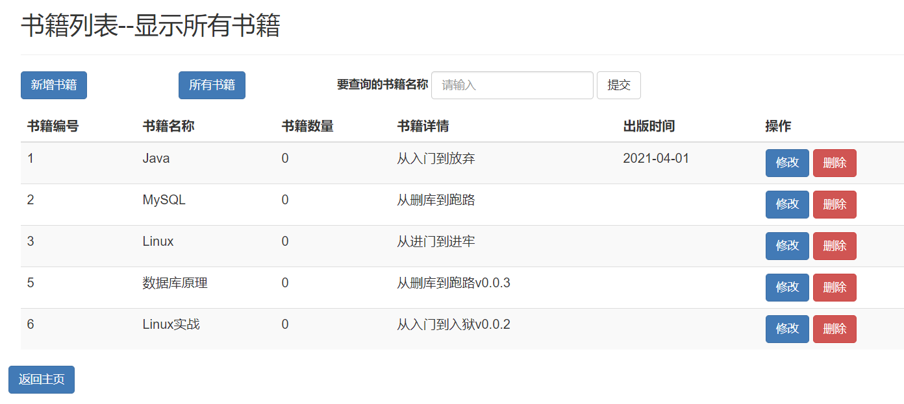

# SSM项目中日期字段的前后端交互与字符串编码问题

**前言**

> 在完成SSM项目基本整合后，通常我们就要开始业务模块的编写，此过程往往会引入新的问题，此文讲解日期字段的交互和请求字符串编码的问题


代码示例请查看[网站](https://github.com/ouyangjunfei/SSMIntegration)

## 1. 数据读取

后端数据的读取包含两种情况

1. 使用模板引擎 (JSP, Thymeleaf, Freemarker) 等，直接把数据渲染到模板，此过程不经过 `RequestMappingHandlerAdapter` 处理返回值，故在实体类上使用的注释比如 `JsonFormat` 不会起作用，如果需要渲染指定的日期格式，需要根据具体模板引擎的语法进行转换
2. 使用 `@ResponseBody` 注解只请求数据时，会根据请求类型调用到一系列`HttpMessageConverter`，`JsonFormat` 注解会起作用

这部分的区别可以查看`BookController.java`源码这部分，并使用类似[Postman](https://www.postman.com/)的工具测试一下

```java
// 查询全部的书籍，并且返回到一个书籍展示页面
@GetMapping(value = "/all")
public String queryAllBooksPage(Model model) {
    List<Book> bookList = bookService.queryAllBooks();
    model.addAttribute("list", bookList);
    return "book";
}

// 查询全部书籍的数据
@PostMapping("/all")
@ResponseBody
public List<Book> queryAllBooksData() {
    return bookService.queryAllBooks();
}
```


## 2. Spring项目日期交互问题

### 2.1 默认情况

**没有引入** `Jackson` **依赖**

**配置文件只使用**

```xml
<mvc:annotation-driven/>
```

实体类不加任何注解，表示时间的字段使用 `Date` 类修饰，传回前端的结果由 `Date` 类内部的 `toString()` 方法转换，具体定义如下

```java
Converts this Date object to a String of the form:
       dow mon dd hh:mm:ss zzz yyyy
where:
dow is the day of the week (Sun, Mon, Tue, Wed, Thu, Fri, Sat).
mon is the month (Jan, Feb, Mar, Apr, May, Jun, Jul, Aug, Sep, Oct, Nov, Dec).
dd is the day of the month (01 through 31), as two decimal digits.
hh is the hour of the day (00 through 23), as two decimal digits.
mm is the minute within the hour (00 through 59), as two decimal digits.
ss is the second within the minute (00 through 61, as two decimal digits.
zzz is the time zone (and may reflect daylight saving time). Standard time zone abbreviations include those recognized by the method parse. If time zone information is not available, then zzz is empty - that is, it consists of no characters at all.
yyyy is the year, as four decimal digits.
```

所以其返回前端的日期形态如下，而正常我想得到的日期应该是形如`yyyy-MM-dd`形态的

> Tue May 18 00:00:00 CST 2021

同时，前端的修改字段功能也会直接报错

> org.springframework.core.convert.ConversionFailedException: Failed to convert from type [java.lang.String] to type [java.util.Date] for value '2021-06-01'

直接用`Post`测试获取数据也失败，报错信息

> No converter found for return value of type: class java.util.ArrayList

这里涉及到更深层次的Spring MVC对返回值的处理过程，大概是一系列`HttpMessageConverter`对输入与输出的判断与识别

经过测试得到结果，目前的返回值只支持`String`类型，其他一律会出现如上的没有对应converter的错误

具体源码位置可以查看方法`org.springframework.web.servlet.mvc.method.annotation.AbstractMessageConverterMethodProcessor#writeWithMessageConverters`

### 2.2 实体类增加Spring的注解

为实体类的日期字段加上注解

```java
@DateTimeFormat(pattern = "yyyy-MM-dd")
```

之后前端发起的修改就可以成功，参考注解的文档说明第一句

> Declares that a field or method parameter should be formatted as a date or time.

只有如此声明才可以把指定的日期字符串转化为我们想要的日期格式

但此时读取的日期还是如 `2.1` 的格式，并且`Post`方式获取数据同样错误

### 2.3 引入Jackson依赖

```xml
<dependency>
    <groupId>com.fasterxml.jackson.core</groupId>
    <artifactId>jackson-databind</artifactId>
    <version>${jackson.version}</version>
</dependency>
```

不要忘记在`Artifacts`中把依赖包加入`lib`文件夹

此时通过`Post`已经可以得到JSON格式的数据，但是日期的内容为时间戳的表示形式

```json
[
    {
        "bookName": "Java",
        "bookCount": 0,
        "detail": "从入门到放弃",
        "bookDate": 1617206400000,
        "bookID": 1
    }
]
```

需要给实体类加上对应的注解

```java
@JsonFormat(pattern = "yyyy-MM-dd", timezone = "GMT+8")
```

此时再通过`Post`方法得到数据就是我们想要的包含指定格式的日期数据

```json
[
    {
        "bookName": "Java",
        "bookCount": 0,
        "detail": "从入门到放弃",
        "bookDate": "2021-04-01",
        "bookID": 1
    }
]
```

下面讲解如何把页面中的日期格式化

### 2.4 JSP页面的日期格式化

日期格式化也完全可以交给前端去做，但是由于我们使用的是模板引擎，何不一次性搞定

针对于不同的模板引擎，日期格式化的方式都各有不同，但是可以肯定的是都提供了对应的方法

此项目中使用的是JSP页面

首先需要加入`JSP标准标签库`

```jsp
<%@ taglib prefix="fmt" uri="http://java.sun.com/jsp/jstl/fmt" %>
```

之后在你想用到日期的值的位置写入

```jsp
<fmt:formatDate value="${book.bookDate}" pattern="yyyy-MM-dd"/>

value表示后端传来的值，pattern是想要得到的日期格式
```

刷新页面，可以得到正确的日期形式



还有一处需要修改的是`修改`页面，模板引擎从后端读取的日期需要正确渲染

```html
<div class="form-group">
    <label for="bookDate">出版时间</label>
    <input type="date" class="form-control" name="bookDate" id="bookDate"
           value="<fmt:formatDate value="${book.bookDate}" pattern="yyyy-MM-dd"/>" required>
</div>
```


## 3. @ResponseBody返回纯字符串中文乱码

这是一个常见的问题，很多同学通过Ajax请求得到的响应数据，中文全部是问号???，而英文正常

我们以这一段代码作为示例

```java
// 用于测试text/plain类型中的中文是否返回正常
@PostMapping("/test")
@ResponseBody
public String testData() {
    return "123测试test";
}
```

此时模拟的是经过若干业务流程后，向前端返回数据，返回的数据保证了中文编码是正常的，接下来的流程交给了Spring MVC框架

问题恰恰就出现在这里

我们之前有提到，`String`类型的返回值对应的处理器为`StringHttpMessageConverter`

而查看其源码

```java
public static final Charset DEFAULT_CHARSET = StandardCharsets.ISO_8859_1;
```

默认编码为`ISO_8859_1`，显然不支持中文的，同时也可以查看响应报文，其`Content-Type`应该是`text/plain;charset=ISO_8859_1`

说明此处是根本原因，而修改思路呢，则是修改`StringHttpMessageConverter`的默认编码

其被注入时关联的注解为`<mvc:annotation-driven/>`，修改成

```xml
<mvc:annotation-driven>
    <mvc:message-converters>
        <bean class="org.springframework.http.converter.StringHttpMessageConverter">
            <constructor-arg name="defaultCharset" value="UTF-8"/>
            <property name="writeAcceptCharset" value="false"/>
        </bean>
    </mvc:message-converters>
</mvc:annotation-driven>
```

再次测试，中文即可正常显示

至于之前使用`@ResponseBody`注解修饰的方法`queryAllBooksData()`，其默认会使用`MappingJackson2HttpMessageConverter`进行消息转换，而其中定义了默认编码为UTF-8，故不存在中文乱码的问题


## 4. JS文件中文乱码

确定`server.xml`中加入了`URIEncoding="UTF-8"`

**并**在Tomcat启动参数中添加`-Dfile.encoding=UTF-8`

